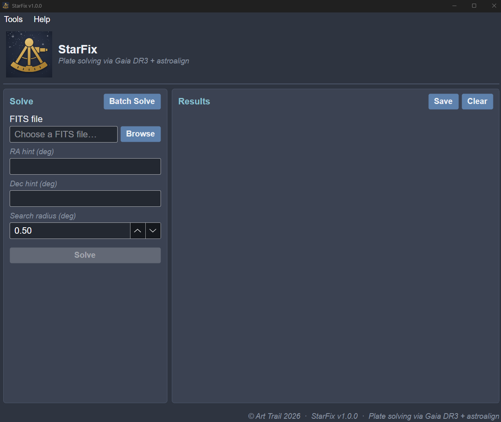
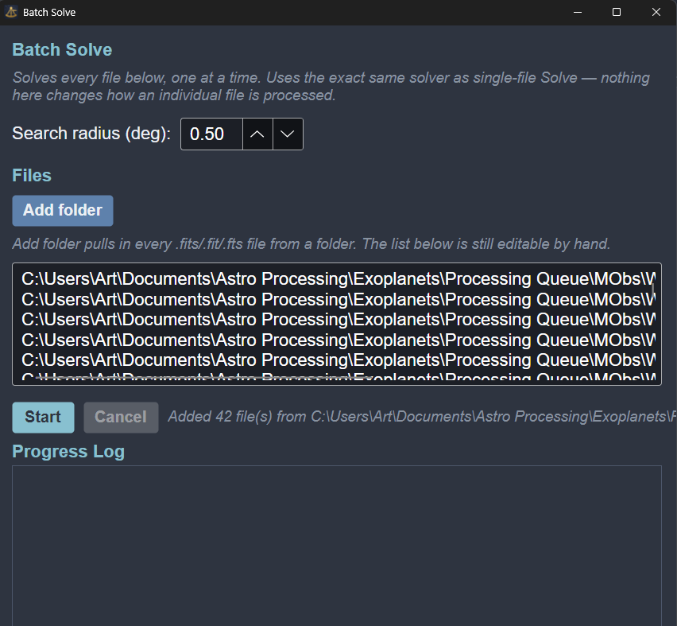

# StarFix

Plate solving via Gaia DR3 + astroalign — a Windows desktop app that finds the exact World Coordinate System (WCS) for astronomical FITS images, matching them against a local, offline copy of the Gaia DR3 catalog.



## Features

- **Single-file and batch plate solving** against a self-built, fully offline Gaia DR3 catalog (down to magnitude 17) — no internet connection needed once the catalog is installed.
- **Fast batch solving**: within a same-target batch, each file after the first tries a shortcut first (reusing the previous file's solved position, rotation, and parity) before falling back to a full geometric search — often near-instant after the first file. Every retry attempt also races several detection/match candidates concurrently instead of trying them one at a time.
- **Overwrite or new-file output modes** — write the WCS into the original file (matching ASTAP's default behavior) or into a numbered copy, leaving the original untouched.
- **Already-solved detection** — batch and single-file solving both check for files that appear already solved and ask before re-solving them.
- **`.fz` (Rice/GZIP tile-compressed) FITS support**, in both the GUI and headless mode.
- **Live Results panel** with the full solve summary (center coordinates, pixel scale, field of view, rotation, matched star count, RMS residual), persisted across restarts — exportable as plain text or CSV.
- **Built-in Gaia catalog manager** with byte-exact integrity verification per downloaded file.
- **Headless / command-line mode** (`StarFix.exe --solve <file> ...`) — lets another app or script trigger a solve without the GUI ever appearing.
- **ASTAP-compatible mode** (`StarFix.exe --astap-compat`) — lets capture software with built-in ASTAP support (N.I.N.A. and similar) use StarFix instead, by pointing its ASTAP executable setting at StarFix.exe. Full setup steps in the in-app User Guide.
- **Self-update checker** — checks GitHub releases on startup and via Help → Check for Updates.
- **Diagnostics log, User Guide, and Revision History** built into the app.



## How it works

StarFix's solver detects stars in the image (photutils' DAOStarFinder), queries the local HEALPix-indexed Gaia DR3 catalog near a position hint, projects catalog positions onto a tangent plane, and matches the two star patterns geometrically (astroalign) to derive the WCS. The full pipeline, algorithms, and academic references are documented in-app under Help → User Guide.

## Requirements

- Windows or macOS (Apple Silicon) — the app targets .NET 8 / Avalonia, with a platform-native solver bundled for each
- The Gaia DR3 catalog (~4.2 GB), downloaded once via Tools → Download Gaia Catalog

## Installation

Download the latest release from the [Releases](../../releases) page — with the solver already bundled:

- **`StarFix-Setup-vX.Y.Z.exe`** (Windows) — a proper installer (Start Menu shortcut, optional desktop shortcut, clean uninstall). Installs per-user, no admin rights needed.
- **`StarFix-vX.Y.Z-win-x64.zip`** (Windows) — a portable, self-contained build. Unzip and run `StarFix.exe` directly, no install step.
- **`StarFix-vX.Y.Z-osx-arm64.dmg`** (macOS, Apple Silicon) — open the DMG, drag StarFix into Applications. Not notarized, so the first launch needs right-click → Open → Open in the security dialog. Intel Mac (`osx-x64`) is not yet available.

## Building from source

This repository contains the StarFix Avalonia (C#/.NET 8) application source. The plate-solving engine itself is a separate Python project, built with PyInstaller into a standalone `solve.exe` and bundled at build time into `PySolver\solve\` (not included in this repo — see the Releases page for a build that already has it, or provide your own compatible `solve.exe` there).

```
dotnet build
```

## License

MIT — see [LICENSE](LICENSE).

## Acknowledgements

- **[Gaia DR3](https://www.cosmos.esa.int/web/gaia/dr3)** (ESA) — astrometric reference catalog
- **[astroalign](https://github.com/quatrope/astroalign)** — asterism/triangle-matching star-pattern registration (MIT license)
- **[astropy](https://www.astropy.org/)** / **[photutils](https://photutils.readthedocs.io/)** — FITS I/O, WCS fitting, and star detection

Full academic references for the algorithms used (DAOFIND/Stetson 1987, the FITS WCS standard, HEALPix, etc.) are listed in-app under Help → User Guide.

---

Developed entirely with [Claude Code](https://claude.com/claude-code) (Anthropic).
